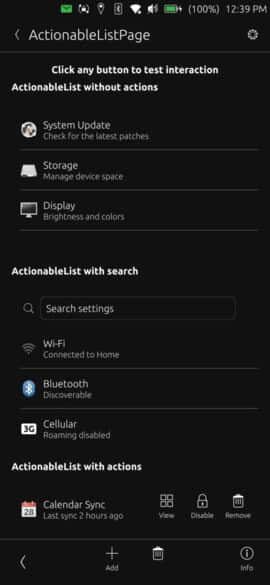

# ActionableList



A searchable list component with customizable item actions for Ubuntu Touch applications. Provides a flexible list view with optional search functionality, item display with title/subtitle/icon, and configurable action buttons per item.

## Properties

- `items` (array): Array of items to display in the list
- `showSearchBar` (bool): Whether to show the search bar above the list (default: false)
- `searchPlaceholder` (string): Placeholder text for the search input field (default: "Search")
- `emptyMessage` (string): Message displayed when the list is empty or no items match the search (default: "No items")
- `searchFields` (array): Property names to search within (default: ["title"])
- `itemActions` (array): Global actions applied to all items (unless overridden by item.customActions)
- `idField` (string): Property name used as unique identifier for items (default: "id")

## Signals

- `itemClicked(item)`: Emitted when a list item is clicked (only if the item has no actions)
- `actionTriggered(actionId, item, actionData)`: Emitted when an action button is triggered

## Item Structure

Each item in the items array can have:
- `title` (string): Main text displayed in the item (required)
- `subtitle` (string): Secondary text displayed below the title (optional)
- `icon` (string): Icon name to display on the left (optional)
- `customActions` (array): Per-item actions that override global itemActions (optional)
- `actionData` (object): Additional data passed with actionTriggered signal (optional)

## Example Usage

### Basic Searchable List
```qml
import "ut_components"

ActionableList {
    height: units.gu(40)
    items: [
        { title: "Document 1", subtitle: "Last modified yesterday", icon: "document" },
        { title: "Document 2", subtitle: "Created today", icon: "document" },
        { title: "Image File", subtitle: "2.5 MB", icon: "image" }
    ]
    showSearchBar: true
    searchPlaceholder: "Search files..."
    onItemClicked: openFile(item)
}
```

### List with Global Actions
```qml
import "ut_components"

ActionableList {
    height: parent.height
    items: contactsModel
    itemActions: [
        { id: "call", iconName: "call-start", text: "Call" },
        { id: "message", iconName: "message", text: "Message" },
        { id: "edit", iconName: "edit", text: "Edit" }
    ]
    onActionTriggered: {
        switch(actionId) {
            case "call": makeCall(item); break;
            case "message": sendMessage(item); break;
            case "edit": editContact(item); break;
        }
    }
}
```

### List with Mixed Actions and Search
```qml
import "ut_components"

ActionableList {
    height: units.gu(50)
    showSearchBar: true
    searchFields: ["title", "subtitle", "tags"]
    items: [
        {
            title: "Protected Item",
            subtitle: "Requires unlock",
            icon: "lock",
            customActions: [
                { id: "unlock", iconName: "lock-broken", text: "Unlock" }
            ]
        },
        {
            title: "Regular Item",
            subtitle: "Standard actions",
            icon: "document"
            // Uses global itemActions
        }
    ]
    itemActions: [
        { id: "view", iconName: "view", text: "View" },
        { id: "share", iconName: "share", text: "Share" }
    ]
    emptyMessage: "No matching items found"
    onActionTriggered: handleAction(actionId, item)
}
```
