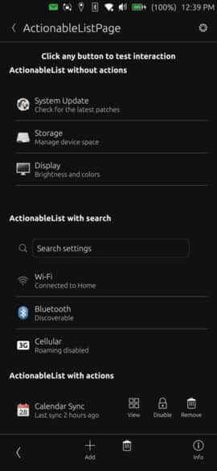

# AppHeader



A simplified page header component that provides consistent navigation and actions across Ubuntu Touch applications. Supports two distinct styles: root pages (with app icon) and sub-pages (with back navigation).

## Properties

- `pageTitle` (string): The title text displayed in the header
- `isRootPage` (bool): Determines header style - true for root pages with icon, false for sub-pages with back button
- `appIconName` (string): Icon name to display on root pages (only used when isRootPage is true)
- `showSettingsButton` (bool): Whether to show a settings button in the trailing position

## Signals

- `settingsClicked`: Emitted when the settings button is clicked

## Example Usage

### Root Page
```qml
import "ut_components"

Page {
    header: AppHeader {
        pageTitle: "My App"
        isRootPage: true
        appIconName: "ubuntu-store-symbolic"
        showSettingsButton: true
        onSettingsClicked: pageStack.push(settingsPage)
    }
}
```

### Sub-Page
```qml
import "ut_components"

Page {
    header: AppHeader {
        pageTitle: "Details"
        isRootPage: false
        showSettingsButton: false
    }
}
```
