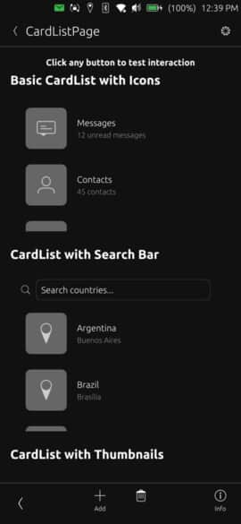

# CardList



A filterable list view component that displays items as cards with optional search functionality. Each item in the list is rendered as a card with title, subtitle, icon, and/or thumbnail. The component handles empty states and provides click feedback for each card.

## Properties

- `items` (array): Array of objects containing card data (`title`, `subtitle`, `icon`, `iconSource`, `thumbnailSource`); `thumbnailSource` takes precedence over icon rendering, and `iconSource` takes precedence over `icon`
- `emptyMessage` (string): Message displayed when items array is empty (default: "No items")
- `showSearchBar` (bool): Whether to show the search bar (default: false)
- `searchPlaceholder` (string): Placeholder text for search field (default: "Search")

## Signals

- `itemClicked(item)`: Emitted when a card is clicked, passes the clicked item object

## Item Structure

Each item in the items array can have:
- `title` (string): Main text displayed in the card
- `subtitle` (string): Secondary text displayed below the title (optional)
- `thumbnailSource` (string): Path or URL to an image to display as thumbnail. When present, it takes precedence over icon rendering.
- `icon` (string): Theme icon name used when `iconSource` is empty (uses the default fallback icon if neither `thumbnailSource`, `iconSource`, nor `icon` is provided)
- `iconSource` (url): Optional custom icon file URL. When set, it takes precedence over `icon`.

## Example Usage

### Basic List
```qml
import "ut_components"

CardList {
    height: units.gu(30)
    items: [
        { title: "Camera", subtitle: "Take photos", icon: "camera-app-symbolic" },
        { title: "Gallery", subtitle: "View photos", icon: "gallery-app-symbolic" },
        { title: "Music", subtitle: "Play music", icon: "music-app-symbolic" }
    ]
    onItemClicked: console.log("Selected:", item.title)
}
```

### List with Custom SVG Icons
```qml
import "ut_components"

CardList {
    height: units.gu(24)
    items: [
        {
            title: "Brand Profile",
            subtitle: "Local SVG icon",
            icon: "go-next",
            iconSource: Qt.resolvedUrl("../assets/logo.svg")
        },
        {
            title: "Thumbnail still wins",
            subtitle: "The thumbnail hides the icon",
            thumbnailSource: "file:///path/to/photo.jpg",
            iconSource: Qt.resolvedUrl("../assets/logo.svg")
        }
    ]
}
```

`iconSource` is optional, but when present it overrides `icon`. `thumbnailSource` still takes precedence over both.

### List with Search
```qml
import "ut_components"

CardList {
    height: units.gu(40)
    showSearchBar: true
    searchPlaceholder: i18n.tr("Search albums...")
    items: albumsModel
    onItemClicked: pageStack.push(albumPage, { album: item })
}
```

### List with Thumbnails
```qml
import "ut_components"

CardList {
    height: parent.height
    items: [
        { title: "Photo 1", subtitle: "Yesterday", thumbnailSource: "file:///path/to/photo1.jpg" },
        { title: "Photo 2", subtitle: "Today", thumbnailSource: "file:///path/to/photo2.jpg" }
    ]
    emptyMessage: i18n.tr("No photos")
    onItemClicked: viewPhoto(item)
}
```

### Dynamic List with Empty State
```qml
import "ut_components"

CardList {
    height: parent.height
    emptyMessage: i18n.tr("No results found")
    showSearchBar: true
    items: searchResults
    onItemClicked: {
        selectedItem = item
        processSelection()
    }
}
```
