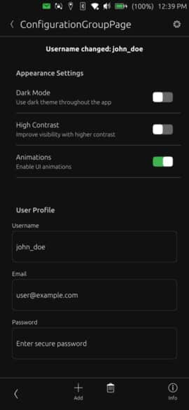

# ConfigurationGroup



A titled container component for grouping related configuration controls in Ubuntu Touch applications. Displays a header label followed by any child components placed inside, keeping settings sections organized and consistent.

## Properties

- `title` (string): Title text shown in the group header
- `children` (list): Direct access to child items inside the group
- `content` (default property, list): Declarative container for child components placed within the group

## Common Component Properties Reference

When using components inside ConfigurationGroup, here are the correct property names:

- **ToggleOption**: `title`, `checked`, `onCheckedChanged(checked)`
- **InputField**: `title`, `placeholder`, `value`
- **NumberOption**: `title`, `value`, `minimumValue`, `maximumValue`, `suffix`, `onValueUpdated(newValue)`

## Example Usage

### Basic Toggle Options
```qml
import "ut_components"

ConfigurationGroup {
    title: "User Preferences"

    ToggleOption {
        title: "Dark Mode"
        checked: true
        onCheckedChanged: theme.darkMode = checked
    }

    ToggleOption {
        title: "Notifications"
        checked: false
        onCheckedChanged: settings.notifications = checked
    }
}
```

### Input Fields for Account Settings
```qml
import "ut_components"

ConfigurationGroup {
    title: "Account Settings"

    InputField {
        title: "Username"
        placeholder: "Enter username"
        value: "john_doe"
        onValueChanged: account.username = value
    }

    InputField {
        title: "Email"
        placeholder: "user@example.com"
        value: "john.doe@example.com"
        inputType: Qt.ImhEmailCharactersOnly
        onValueChanged: account.email = value
    }

    InputField {
        title: "Password"
        placeholder: "Enter password"
        echoMode: TextInput.Password
        onValueChanged: account.updatePassword(value)
    }
}
```

### Number Options with Validation
```qml
import "ut_components"

ConfigurationGroup {
    title: "Display Settings"

    NumberOption {
        title: "Font Size"
        value: 14
        minimumValue: 8
        maximumValue: 32
        suffix: "pt"
        onValueUpdated: display.fontSize = newValue
    }

    NumberOption {
        title: "Screen Timeout"
        value: 30
        minimumValue: 10
        maximumValue: 300
        suffix: " seconds"
        onValueUpdated: display.timeout = newValue
    }
}
```

### Mixed Control Types
```qml
import "ut_components"

ConfigurationGroup {
    title: "Network Configuration"

    ToggleOption {
        title: "Wi-Fi"
        checked: true
        onCheckedChanged: network.wifiEnabled = checked
    }

    ToggleOption {
        title: "Bluetooth"
        checked: false
        onCheckedChanged: network.bluetoothEnabled = checked
    }

    InputField {
        title: "Proxy Server"
        placeholder: "proxy.example.com:8080"
        onValueChanged: network.proxy = value
    }

    NumberOption {
        title: "Connection Timeout"
        value: 30
        minimumValue: 5
        maximumValue: 120
        suffix: " seconds"
        onValueUpdated: network.timeout = newValue
    }
}
```

### Advanced Configuration Example
```qml
import "ut_components"

ConfigurationGroup {
    title: "Advanced Options"

    ToggleOption {
        title: "Developer Mode"
        checked: false
        onCheckedChanged: app.developerMode = checked
    }

    ToggleOption {
        title: "Experimental Features"
        checked: false
        onCheckedChanged: app.experimentalFeatures = checked
    }

    NumberOption {
        title: "Cache Size"
        value: 100
        minimumValue: 0
        maximumValue: 500
        suffix: " MB"
        onValueUpdated: app.cacheSize = newValue
    }

    InputField {
        title: "Custom API Endpoint"
        placeholder: "https://api.example.com"
        onValueChanged: app.apiEndpoint = value
    }
}
```

### Empty Group
```qml
import "ut_components"

// ConfigurationGroup can also be empty, showing just the title
ConfigurationGroup {
    title: "Coming Soon"
}
```
