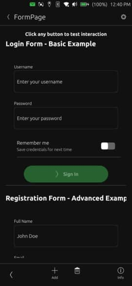

# Form



A form container that vertically stacks input fields and exposes a single submit button. The button remains disabled until all child fields report valid state and emits a unified `submitted` signal when activated.

## Properties

- `fields` (default property): Add child input components declaratively inside the form
- `buttonText` (string): Label text displayed on the submit button (default: `i18n.tr("Submit")`)
- `buttonIconName` (string): Theme icon name used when `buttonIconSource` is empty (default: empty)
- `buttonIconSource` (url): Optional custom icon file URL for the submit button. When set, it takes precedence over `buttonIconName`.
- `allFieldsValid` (bool, read-only): Reflects whether every child field exposing `isValid` is currently valid

## Signals

- `submitted`: Emitted when the submit button is pressed while all fields are valid

## Example Usage

### Basic Form
```qml
import "ut_components"

Form {
    buttonText: i18n.tr("Create account")
    buttonIconName: "ok"
    onSubmitted: authController.submit()

    TextField {
        placeholderText: i18n.tr("Email")
        property bool isValid: text.length > 0 && text.indexOf("@") !== -1
    }

    TextField {
        placeholderText: i18n.tr("Display name")
        property bool isValid: text.trim().length > 2
    }

    PasswordField {
        placeholderText: i18n.tr("Password")
        property bool isValid: text.length >= 8
    }
}
```

### Form with Custom Submit Icon
```qml
import "ut_components"

Form {
    buttonText: i18n.tr("Continue with Brand")
    buttonIconName: "go-next"
    buttonIconSource: Qt.resolvedUrl("../assets/logo.svg")
    onSubmitted: connectWorkspace()

    TextField {
        placeholderText: i18n.tr("Workspace")
        property bool isValid: text.length > 2
    }
}
```

`buttonIconSource` is optional, but when both properties are provided it overrides `buttonIconName`.
