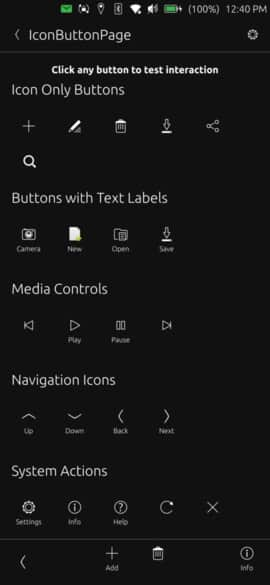

# IconButton



A circular button component that displays an icon with an optional text label below. Features smooth press animation and adapts its size based on content.

## Properties

- `iconName` (string): The name of the icon to display (default: "settings")
- `text` (string): Optional text label to display below the icon (default: "")

## Signals

- `clicked`: Emitted when the button is pressed

## Example Usage

### Icon Only
```qml
import "ut_components"

IconButton {
    iconName: "add"
    onClicked: console.log("Add button clicked")
}
```

### Icon with Text Label
```qml
import "ut_components"

IconButton {
    iconName: "edit"
    text: "Edit"
    onClicked: pageStack.push(editPage)
}
```
