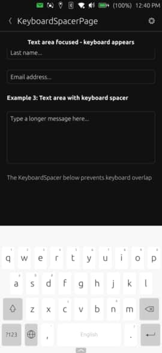

# KeyboardSpacer



An automatic spacer component that adjusts its height to match the virtual keyboard. Prevents keyboard from covering UI elements by creating space when the keyboard appears and collapsing when hidden.

## Properties

This component has no configurable properties - it automatically responds to keyboard visibility.

## Example Usage

### In a Column Layout
```qml
import "ut_components"

Column {
    width: parent.width

    TextField {
        width: parent.width
        placeholderText: "Type here..."
    }

    Button {
        text: "Submit"
        anchors.horizontalCenter: parent.horizontalCenter
    }

    KeyboardSpacer {
        // Automatically pushes content above when keyboard appears
    }
}
```

### In a Scrollable Page
```qml
import "ut_components"

Page {
    Flickable {
        anchors.fill: parent
        contentHeight: content.height

        Column {
            id: content
            width: parent.width

            TextField {
                width: parent.width
                placeholderText: "Name"
            }

            TextArea {
                width: parent.width
                height: units.gu(20)
                placeholderText: "Description"
            }

            KeyboardSpacer {
                // Creates scrollable space when keyboard is visible
            }
        }
    }
}
```

### At Bottom of Form
```qml
import "ut_components"

Page {
    Column {
        anchors.fill: parent

        // Form fields at the top
        Item {
            width: parent.width
            height: parent.height - keyboardSpacer.height - submitButton.height

            // Your form content here
        }

        Button {
            id: submitButton
            text: "Submit"
            width: parent.width
        }

        KeyboardSpacer {
            id: keyboardSpacer
            // Keeps submit button visible above keyboard
        }
    }
}
```
