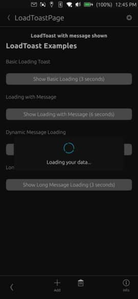

# LoadToast



A full-screen loading overlay component that displays an activity indicator with optional message text. Blocks user interaction while showing a loading state with smooth fade transitions.

## Properties

- `showing` (bool): Controls the visibility of the overlay (default: false)
- `message` (string): Optional text to display below the spinner (default: "")

## Example Usage

### Simple Loading State
```qml
import "ut_components"

LoadToast {
    id: loadingOverlay
    showing: dataModel.isLoading
    message: "Loading data..."
}
```

### Dynamic Loading with Async Operation
```qml
import "ut_components"

Page {
    LoadToast {
        id: saveToast
        message: "Saving changes..."
    }

    Button {
        text: "Save"
        onClicked: {
            saveToast.showing = true
            backend.saveData(function() {
                saveToast.showing = false
            })
        }
    }
}
```

### Loading Without Message
```qml
import "ut_components"

LoadToast {
    showing: networkRequest.inProgress
    // No message - shows only spinner
}
```
